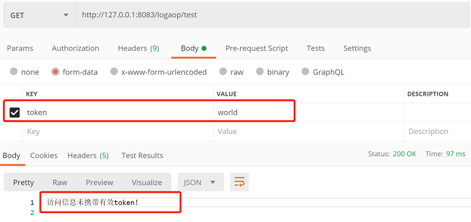
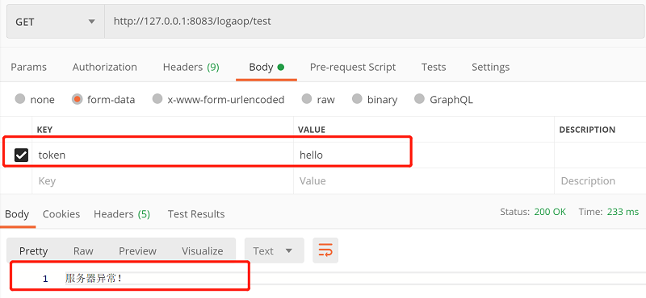

# 一、AOP记录日志介绍

&emsp;&emsp;基于Spring Boot框架，使用AOP相关特性记录日志信息。

- 将日志信息存入数据库
- 当请求发生异常时自定义返回的提示信息
- 将日志信息存入本地日志文件，发生异常时存储完整的堆栈信息
- 自定义拦截器结合自定义注解，模拟验证请求信息是否有正确的Token参数

# 二、前期准备

## 2.1 MySQL数据库准备:

- 对应的SQL见 /src/main/resources/sql/CreateTableSQL.sql
- 创建数据库mybatis
- 建表 - logaopinfo(日志记录信息)
- MySQL配置信息见 /src/main/resources/application.properties

## 2.2 PostMan测试工具准备:

- [下载地址](https://www.postman.com/)

# 三、实现效果

&emsp;&emsp;自定义拦截器请求测试：

&emsp;&emsp;请求测试（**携带正确的Token信息**），发生异常时返回自定义提示信息：

&emsp;&emsp;请求发生异常时，查看本地日志文件：

&emsp;&emsp;查看数据库日志记录信息，如下所示：  

